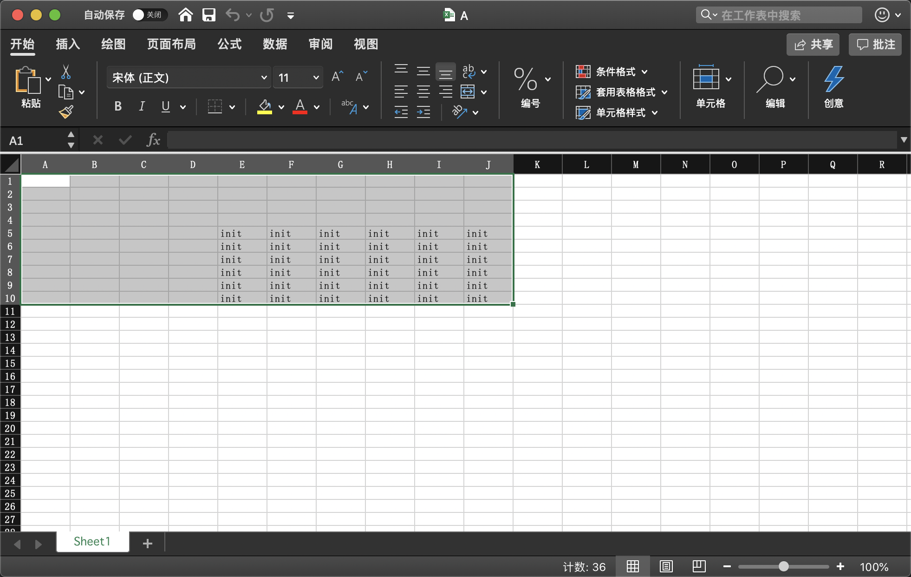

## FuckExcel

- Easier to operate excel.

### demo

```python
from FuckExcel import FuckExcel

fuck_excel = FuckExcel('./A.xlsx')
fuck_excel[5:10, 5:10] = 'init' # or ['init', 'init', 'init', 'init', 'init']
fuck_excel.save()
```

- Demo will create `A.xlsx` and set init value.


